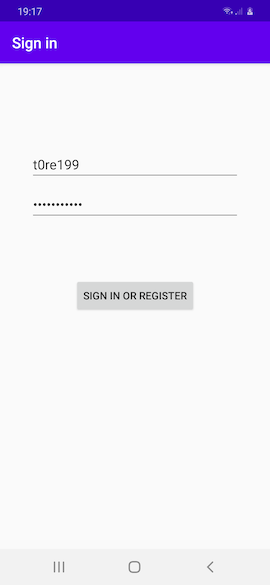
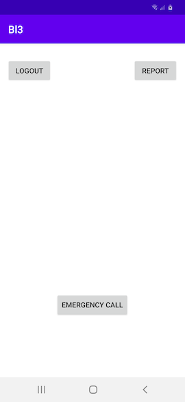
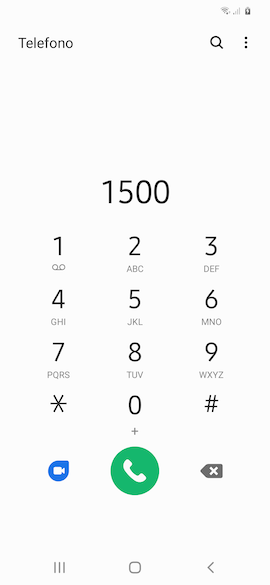
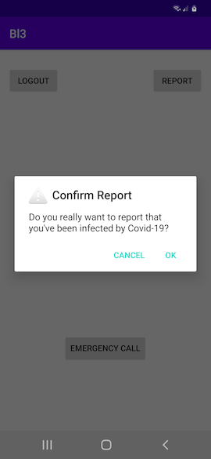
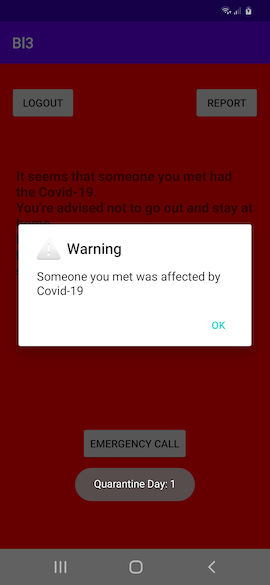
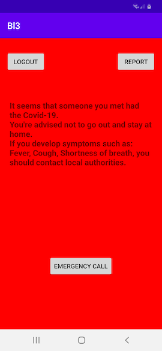

# README #

**Bl3**, whose name derivies from **B**luetooth **l**ow **e**nergy, is a distributed system for Covid-19 **contact tracing**. It's a centralized alterative to Apple and Google's one, totally selfcontained.   
   
The system consists in an **Android Application** and a **JavaEE Backend**.     
   
Not open-source (yet?).   

## Bl3 & Privacy ##

* No reference to user identities, when a user register at bl3, it gets a 20-bytes identifier. This identifier is generated regardless username and/or device.    
    
Moreover:   
    
* Usernames and Passwords are stored in SHA256 format.  
   
* Once the user has logged in, the server provides to the android application a Json Web Token \([JWT](https://jwt.io/)\) that will be used for any further interaction.  

## Bl3 Backend ##

The backend was developed by using the **Java Enterprise Edition 7** stack. Enterprice Java Been (**EJB**) have been used for defining the business logic. The JAX-RS Api has been used to implement **REST Web Services** while the Java Persistence Api (**JPA**) and the ORM **Hibernate** have been used for persistency.   
    
Maven has been used as a build system.   

## Bl3 Android App ##

The Android application has been entierly written in Java. Gradle has been used as Build System.  
   

### Some Tecnical Consideration About The App ###
   
* Device-To-Device communication is performed by using the bluetooth low energy **GATT protocol**.    
        
* Device-To-Server communication is performed by using a specially deisigned **REST Client**.     
    
* A local **Cache** with schedulable refresh rate has been provided in order to skip very recently met users.   
   
* A **DataHandler** has been provided in order to buffer on the device met user and send them to the server once they reach a considerable number or a given amount of time has elapsed.   

### Main App's Functionalities ###
   
* Allows users sign-in/log-in.   

* Periodically scans for users and tries to get their id and so, register the contact.   
   
* Allows users to report their Covid-19 infections.      
    
* Periodically contact the server to check if the user met someone infected by Covid-19.   
   
* Allows to contact emergency numbers.   

### Screenshots ###

**Sign-in/Log-in view.**   
     
   
    
**Main view.**   
     
  
   
**Emergency call view.**   
     
   

**Reporting Covid-19 infection.**   
     

    
**Infected user mode**
     
   
    
